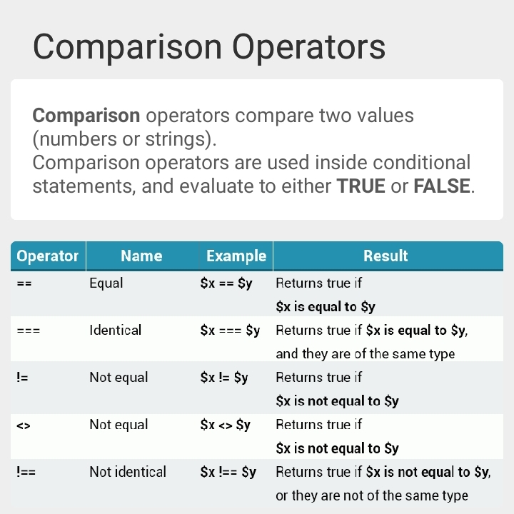

# php_notes

# Echo [ echo ]
- echo

# Variables  [ var ]
- basic var
- define
- global

# Arithmetic
- Addition
- Subtraction
- Multiplication
- Division
- Modules
-Data type
- Boolean
- x++ and x--

# Comparisond

